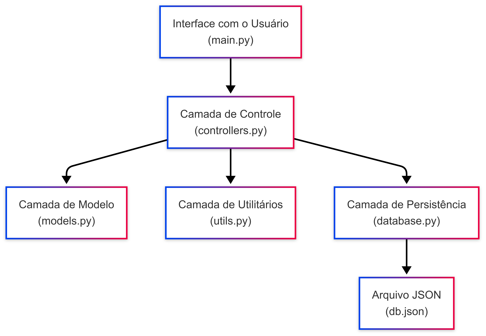

<p align="center">
  
</p>


# 🎓 Sistema de Controle de Frequência Escolar

Este projeto é um sistema simples de controle de frequência de alunos, utilizando arquitetura em camadas e interface via terminal (CLI), desenvolvido em **Python**.

---

## ✅ Funcionalidades

- Cadastro de turmas
- Cadastro de alunos
- Registro de presença (Presente / Faltou)
- Consulta de frequência por turma
- Relatório individual por aluno
- Listagem de turmas e alunos

---

## 🧠 Arquitetura

O sistema foi implementado seguindo o padrão de **Arquitetura em Camadas**, promovendo separação de responsabilidades e facilidade de manutenção.

### Camadas:

| Camada               | Arquivo           | Responsabilidade |
|----------------------|-------------------|------------------|
| Interface com o Usuário | `main.py`         | Interação com o usuário via terminal |
| Controle / Negócios     | `controllers.py`  | Lógica da aplicação |
| Modelos de Dados        | `models.py`       | Representação de Turma, Aluno, Presença |
| Utilitários             | `utils.py`        | Funções auxiliares (IDs, datas, menus) |
| Persistência            | `database.py`     | Leitura e gravação dos dados em JSON |

---

## 🗂️ Diagrama da Arquitetura

> 📌 Imagem ilustrando a separação entre camadas e fluxo de chamadas:




---

## 💻 Tecnologias Utilizadas

- **Python 3.10+**
- **Bibliotecas padrão**:
  - `json`, `os`, `datetime`, `time`, `random`, `shutil`, `sys`
- **Formato de dados**: `db.json` (persistência local)

---

## 📦 Requisitos de Execução

- Python 3 instalado
- Ambiente de terminal (Windows, Linux ou macOS)
- Nenhuma dependência externa

---

## 🚀 Como Executar

```bash
git clone https://github.com/seu-usuario/seu-repositorio.git](https://github.com/Psyd3r/presenca-alunos-python
cd presenca-alunos-python
python main.py
